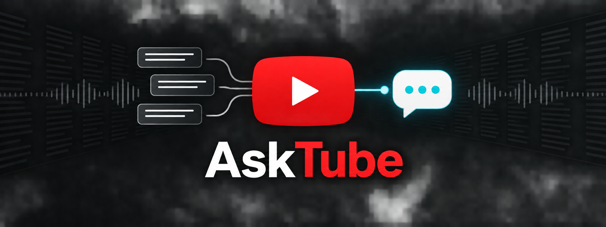

<div align="center">
  

  <h1>AskTube</h1>

  <p>Chat with YouTube videos using transcript-grounded AI.</p>

  <p>
    
    
    
    
    
  </p>
</div>

Ask questions about any YouTube video with an available transcript. AskTube
retrieves relevant transcript sections and uses them to generate grounded answers
and concise video summaries.

## ✨ Features

- Accepts standard YouTube URLs, Shorts URLs, embed URLs, and video IDs
- Supports transcripts in eight languages
- Answers questions using retrieved transcript context
- Generates summaries for short and long videos
- Shows the transcript chunks used for each answer
- Runs locally or on Streamlit Community Cloud

## 🧰 Tech stack

- **Streamlit** - user interface
- **YouTube Transcript API** - transcript extraction
- **Hugging Face Inference API** - cloud embeddings
- **FAISS** - local vector search
- **Groq** - answer and summary generation
- **LangChain** - RAG pipeline

No OpenAI API is required.

## 🏗️ Architecture

```text
YouTube URL
    ↓
Transcript
    ↓
Text chunks
    ↓
Hugging Face cloud embeddings
    ↓
FAISS
    ↓
Question
    ↓
Similarity search
    ↓
Relevant transcript chunks
    ↓
Groq LLM
    ↓
Answer
```

## 📁 Project structure

```text
AskTube/
├── .github/workflows/tests.yml
├── .streamlit/
│   └── config.toml
├── assets/
│   └── asktube-banner.png
├── app.py
├── youtube_rag/
│   ├── __init__.py
│   ├── config.py
│   ├── ui.py
│   └── services/
│       ├── __init__.py
│       ├── rag.py
│       └── youtube.py
├── tests/
│   ├── test_rag.py
│   └── test_youtube.py
├── .env.example
├── .gitignore
├── requirements.txt
└── README.md
```

## 🚀 Getting started

### 1. Create a virtual environment

```bash
python -m venv .venv
source .venv/bin/activate
```

On Windows:

```bash
.venv\\Scripts\\activate
```

### 2. Install packages

```bash
pip install -r requirements.txt
```

### 3. Add the API keys

Copy the example environment file:

```bash
cp .env.example .env
```

Then edit `.env`:

```env
GROQ_API_KEY=your_groq_api_key_here
GROQ_MODEL=llama-3.1-8b-instant
EMBEDDING_MODEL=sentence-transformers/all-MiniLM-L6-v2
HUGGINGFACEHUB_API_TOKEN=your_hugging_face_token_here
```

Both API keys are required. Embeddings run through Hugging Face cloud inference.

### 4. Run the app

```bash
streamlit run app.py
```

Open the URL shown by Streamlit, process a video, and start asking questions.

## ✅ Tests

Run the unit tests with:

```bash
python -m unittest discover -s tests
```

## ☁️ Streamlit Cloud deployment

Push these files to GitHub and deploy `app.py` with Streamlit Community Cloud.

In Streamlit Cloud, add this under **App settings → Secrets**:

```toml
GROQ_API_KEY = "your_groq_api_key_here"
GROQ_MODEL = "llama-3.1-8b-instant"
EMBEDDING_MODEL = "sentence-transformers/all-MiniLM-L6-v2"
HUGGINGFACEHUB_API_TOKEN = "your_hugging_face_token_here"
```

Do not commit `.env` or `secrets.toml` to GitHub.

## 🔎 How it works

The project avoids a paid embedding service:

```text
Embeddings → sentence-transformers/all-MiniLM-L6-v2 → Hugging Face cloud inference
Vector DB  → FAISS → runs locally
LLM        → Groq API
UI         → Streamlit
```

Groq account limits and available models can change, so if the default model is unavailable, replace `GROQ_MODEL` with a model currently available in your Groq account.

## 📝 Notes

Some cloud-hosted environments can be blocked by YouTube when requesting transcripts. If a video works locally but not on Streamlit Cloud, that may be a YouTube/network restriction rather than a RAG issue.
